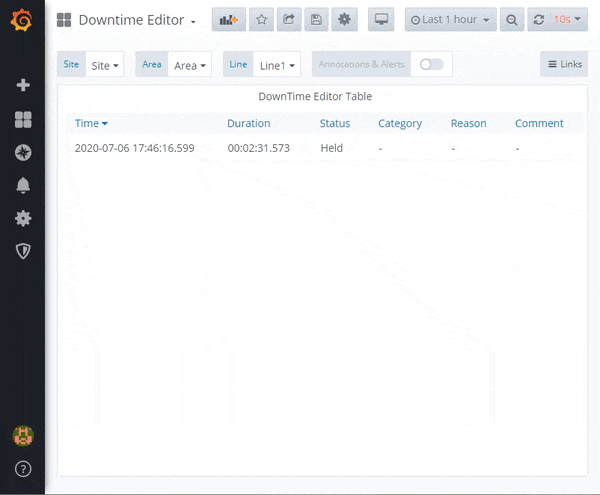
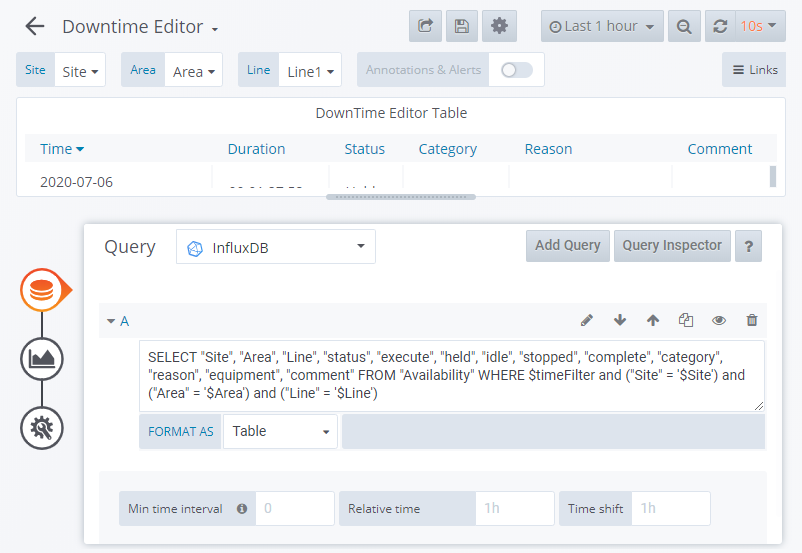

# Event Editor Table Panel

> Libre Grafana Panel to assign Downtime Event Reasons

This panel gives users the ability to list downtime reasons and edit them to assign a downtime category, reason and comment. Users can also split event to correctly capture downtime information. This panel is part of [Libre](https://github.com/Spruik/Libre). Downtime categories and reasons are defined in [Libre Reason Code CRUD Tree Chart Panel](https://github.com/Spruik/Libre-Reason-Codes-CRUD-Tree-Chart-Panel). This plugin interfaces to a no security json rest api for materials running on the same grafana server. This panel is targeted at Grafana v6.x.x only.



## Installation

The easiest way to get started with this plugin is to [download the latest release](https://github.com/Spruik/Libre-Event-Editor-Table-Panel/releases/latest/download/libre-event-editor-table-panel.zip), unzip into grafana plugin directory and restart grafana.

Download the latest release

```shell
$ wget https://github.com/Spruik/Libre-Event-Editor-Table-Panel/releases/latest/download/libre-event-editor-table-panel.zip
Resolving github.com (github.com)... 140.82.114.4
...
2020-06-24 20:47:59 (1.08 MB/s) - 'libre-event-editor-table-panel.zip' saved [90150]
```

Unzip into your Grafana plugin directory

```shell
$ unzip libre-event-editor-table-panel.zip -d /var/lib/grafana/plugins
Archive: libre-event-editor-table-panel.zip
...
inflating: /var/lib/grafana/libre-event-editor-table-panel/utils.js.map
```

Restart Grafana

```shell
$ service grafana-server restart
 * Stopping Grafana Server
 * Starting Grafana Server
```

## Usage

In order to get the most out of this panel:

1. Add dashboard variables for *Site*, *Area* and *Line* from the database. For example:

| Variable | Definition                                                                                                      |
|----------|-----------------------------------------------------------------------------------------------------------------|
| $Site    | `SELECT site FROM equipment`                                                                                    |
| $Area    | `SELECT area FROM equipment WHERE area IS NOT NULL AND site = '$Site'`                                          |
| $Line    | `SELECT production_line FROM equipment WHERE production_line IS NOT NULL AND area = '$Area' AND site = '$Site'` |

2. Add a *Table* metric to query the held machine state for a given line

```influxdb
SELECT
  "Site"
  ,"Area"
  ,"Line"
  ,"status"
  ,"duration"
  ,"execute"
  ,"held"
  ,"idle"
  ,"stopped"
  ,"complete"
  ,"category"
  ,"reason"
  ,"equipment"
  ,"comment"
FROM "Availability"
WHERE $timeFilter
  AND "Site" = '$Site'
  AND "Area" = '$Area'
  AND "Line" = '$Line'
```



3. Apply custom column styles:

| Time format should be 'YYYY-MM-DD HH:mm:ss.SSS' to avoid unwanted results.

| Column               | Type   | Name Override | Other                   |
|----------------------|--------|---------------|-------------------------|
| Time                 | Date   | Time          | YYYY-MM-DD HH:mm:ss.SSS |
| duration             | String | Duration      |            -            |
| status               | String | Status        |            -            |
| category             | String | Category      |            -            |
| reason               | String | Reason        |            -            |
| comment              | String | Comment       |            -            |
| execute              | Hidden |       -       |            -            |
| held                 | Hidden |       -       |            -            |
| idle                 | Hidden |       -       |            -            |
| stopped              | Hidden |       -       |            -            |
| complete             | Hidden |       -       |            -            |
| durationint          | Hidden |       -       |            -            |
| Site                 | Hidden |       -       |            -            |
| Area                 | Hidden |       -       |            -            |
| Line                 | Hidden |       -       |            -            |
| equipment            | Hidden |       -       |            -            |

4. Configure the panel Row Option `Min Duration:` to the shortest downtime duration to display in minutes. Use this setting to avoid nuisance events. For example 5.

5. Data configuration:

- Measurement:  `Availability`
- Reason codes: `reason_code`
- Equipment:    `equipment`

### Add/Edit Reason

Click the event in the table, select a category and reason. Type in a comment and click save.

### Split Reason

Click the event in the table, select a category and reason. Type in a comment and click split. Drag the slider to the correct time to split the event. Alternatively use the edit button, type in the desired timestamp and click save. Use the left/right select to choose which side of the split event to apply the currently selected category, reason and comment too. Click save to split the event.

## Developing

### Getting Started

A docker-compose and grunt script is provided in order to quickly evaluate source code changes. This requires

Prerequisites

- docker (>= 18 required)
- docker-compose (>= 1.25 required)
- node (>= 12 required)
- npm (>= 6 required)

Start by cloning this repository

```shell
~/
$ git clone https://github.com/Spruik/Libre-Event-Editor-Table-Panel
Cloning into 'Libre-Event-Editor-Table-Panel'...
remote: Enumerating objects: 46, done.
remote: Counting objects: 100% (46/46), done.
remote: Compressing objects: 100% (31/31), done.
remote: Total 46 (delta 13), reused 46 (delta 13), pack-reused 0
Unpacking objects: 100% (46/46), done.
```

Enter project and install dependencies

$ cd ./Libre-Event-Editor-Table-Panel
~/Libre-Event-Editor-Table-Panel
$ npm install
...
added 714 packages from 399 contributors and audited 719 packages in 11.871s
found 42 vulnerabilities (11 low, 6 moderate, 25 high)
  run `npm audit fix` to fix them, or `npm audit` for details
```

Install Grunt globally

```shell
$ npm install grunt -g
C:\Users\user\AppData\Roaming\npm\grunt -> C:\Users\user\AppData\Roaming\npm\node_modules\grunt\bin\grunt
+ grunt@1.1.0
updated 1 package in 1.364s
```

Run grunt to build the panel

```shell
~/Libre-Event-Editor-Table-Panel
$ grunt
Running "copy:src_to_dist" (copy) task
Created 3 directories, copied 9 files

Running "copy:libs" (copy) task
Copied 1 file

Running "copy:readme" (copy) task
Created 1 directory, copied 8 files

Running "string-replace:dist" (string-replace) task

1 files created

Running "copy:pluginDef" (copy) task
Copied 1 file

Running "babel:dist" (babel) task

Done, without errors.

```

Start docker-compose.dev.yml detached

```shell
~/Libre-Event-Editor-Table-Panel
$ docker-compose -f docker-compose.dev.yaml up -d
Creating network "libre-event-editor-table-panel_default" with the default driver
Creating libre-event-editor-table-panel_postgres_1 ... done
Creating libre-event-editor-table-panel_influx_1   ... done
Creating libre-event-editor-table-panel_postrest_1 ... done
Creating libre-event-editor-table-panel_grafana_1   ... done
Creating libre-event-editor-table-panel_simulator_1 ... done

```

Run grunt watch to recompile on change

```shell
~/Libre-Event-Editor-Table-Panel
$ grunt watch
Running "watch" task
Waiting...
```

Open your favourite editor and start editing ./src files. The grunt watch task will detect this and recompile the panel. Use your favourite web browser and point to http://localhost:3000 login and create a dashboard with this panel. Your browser will need to be refreshed to reflect your changes to this panel, ensure your browser isn't caching files.

### Building

Prerequisites

- node (>= 12 required)
- npm (>= 6 required)

Build panel and zip into archive

```shell
~/Libre-Event-Editor-Table-Panel
$ grunt build
Running "clean:0" (clean) task
>> 1 path cleaned.

Running "clean:1" (clean) task
>> 0 paths cleaned.

Running "copy:src_to_dist" (copy) task
Created 3 directories, copied 9 files

Running "copy:libs" (copy) task
Copied 1 file

Running "copy:readme" (copy) task
Created 1 directory, copied 8 files

Running "string-replace:dist" (string-replace) task

1 files created

Running "copy:pluginDef" (copy) task
Copied 1 file

Running "babel:dist" (babel) task

Running "compress:main" (compress) task
>> Compressed 50 files.

Done, without errors.

```

Find a completed build of this panel in the root directory named `libre-event-editor-table-panel.zip`.

## Contributing

For any issue, there are fundamentally three ways an individual can contribute:

- By opening the issue for discussion: For instance, if you believe that you have uncovered a bug in, creating a new issue in the [GitHub issue tracker](https://github.com/Spruik/Libre-Event-Editor-Table-Panel/issues) is the way to report it.
- By helping to triage the issue: This can be done either by providing supporting details (a test case that demonstrates a bug), or providing suggestions on how to address the issue.
- By helping to resolve the issue: Typically, this is done either in the form of demonstrating that the issue reported is not a problem after all, or more often, by opening a Pull Request that changes some bit of something in the panel in a concrete and reviewable manner.

## Change log

- 1.0.1 Documentation Update
  - Fix subtitle & project path
  - Remove unused grunt config

- 1.0.0 Initial Public Release
